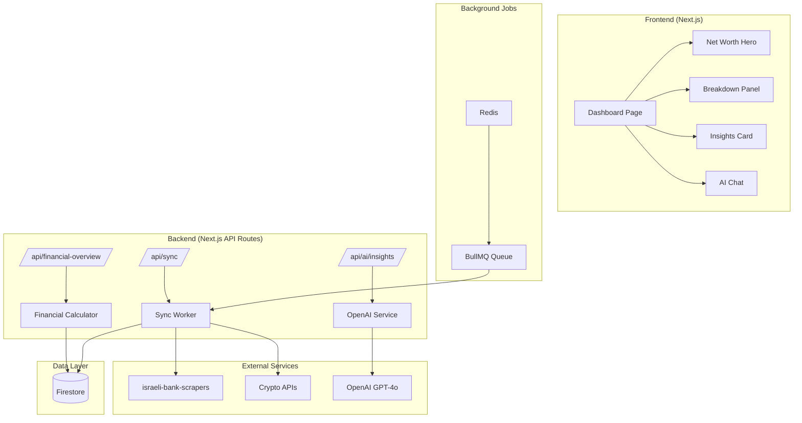
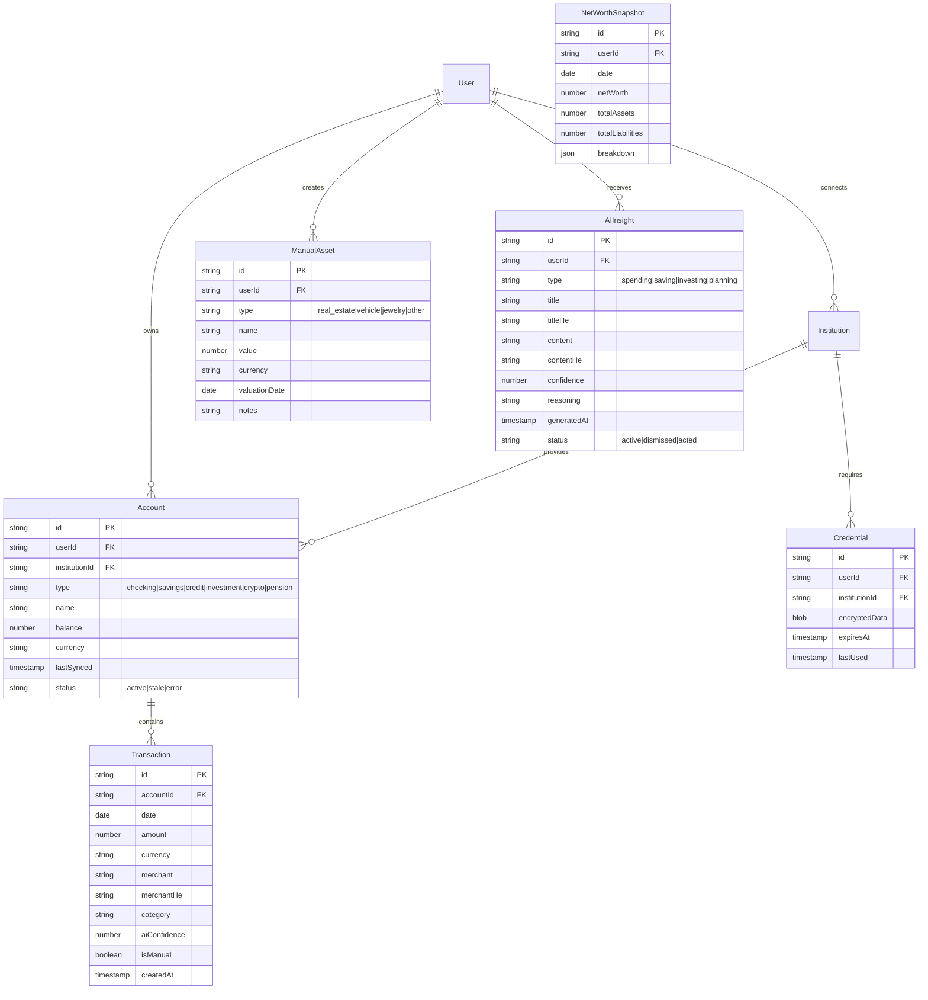

# feat: Transform into Comprehensive Israeli Net Worth & Financial Intelligence Platform

> **⚠️ STATUS: ~40-50% IMPLEMENTED** (Verified January 19, 2026)
>
> **Completed Features:**
> - ✅ Phase 1: Core net worth dashboard (NetWorthHero, NetWorthBreakdown)
> - ✅ Phase 4: Crypto integration (ccxt library), Manual assets, Pension tracking, Investments
> - ⚠️ Phase 2: Israeli banking via external scraper microservice (not npm package as planned)
> - ⚠️ Phase 3: Basic AI features (categorization, chat), but no context-builder or confidence scoring
>
> **Not Implemented:**
> - ❌ Phase 1: NetWorthTrendChart, CategoryDrillDown, WhyChangedPanel, Hebrew/RTL
> - ❌ Phase 2: BullMQ/Redis job queue, bank connection wizard
> - ❌ Phase 3: financial-context-builder, confidence scoring, explainability
> - ❌ Phase 5: Hebrew/RTL, offline mode, push notifications
>
> **Action Required:** Either continue implementation OR archive this plan and document completed work.

**Type:** Major Feature / Platform Transformation
**Priority:** Critical
**Created:** 2025-01-06
**Last Verified:** 2026-01-19

---

## Overview

Transform the existing Finsight AI Dashboard into a comprehensive **Personal Net Worth & Financial Intelligence Platform** specifically tailored for Israeli users. The platform will provide real-time visibility into total net worth across all financial sources (Israeli banks, credit cards, crypto, pension, investments), intelligent cash flow analysis, and AI-powered financial planning assistance.

### Vision Statement

> "Open the application and know exactly your net worth, and why."

The user should be able to:
1. **See total net worth immediately** upon opening the app
2. **Understand the breakdown** - assets vs liabilities, by source
3. **Connect all Israeli financial sources** - banks, credit cards, crypto, pension, stocks
4. **Track cash flow** - all income, expenses, assets, liabilities
5. **Get AI-powered assistance** - accurate financial planning and insights
6. **Experience beautiful, intuitive design** - easy to understand and navigate

---

## Problem Statement

### Current State Issues

The existing application is described as "a little mess" that doesn't fit the user's vision. Specifically:

1. **No unified net worth view** - Financial data is scattered across different pages
2. **Limited Israeli support** - While Salt Edge integration exists, it's not the primary focus
3. **Incomplete integrations** - Crypto, pension, and stocks are partially implemented
4. **AI not centrally featured** - AI categorization exists but isn't a core experience
5. **UX lacks clarity** - Not immediately obvious what user's financial position is

### Research Findings: Current Codebase

**Tech Stack (Solid Foundation):**
- Next.js 14 with App Router
- TypeScript (strict mode)
- Tailwind CSS + Design System
- Firebase (Auth + Firestore)
- Plaid + Salt Edge integrations
- OpenAI GPT-4/GPT-5.1
- SWR for data fetching

**Existing Features (75% production-ready):**
- Financial calculator (`src/lib/financial-calculator.ts`) - production-grade
- Transaction management with AI categorization
- UI component library (Button, Card, Modal, etc.)
- Authentication system
- Dashboard with net worth display (needs enhancement)

**Key Gap:** The app has pieces but lacks cohesive Israeli-focused net worth experience.

---

## Proposed Solution

### Core Concept: Net Worth-Centric Design

Every aspect of the app centers around the **net worth number**. The user experience flows:

```
Open App → See Net Worth (₪687,350) → Tap to Expand → See Breakdown → Drill Down → Get Insights → Take Action
```

### Key Innovation: israeli-bank-scrapers Integration

**Critical Discovery:** All major Israeli fintech apps (Caspion, Finanda, RiseUp) use the open-source `israeli-bank-scrapers` npm package. This is:
- **Free** (MIT license)
- **Comprehensive** (13 banks + 4 credit cards)
- **Proven** (15K+ weekly downloads)
- **4.5x-7.6x cheaper** than commercial aggregators

### Supported Israeli Institutions

| Type | Institutions |
|------|-------------|
| **Banks** | Hapoalim, Leumi, Discount, Mizrahi-Tefahot, Mercantile, Union, Beinleumi, Otsar Hahayal, Massad, Yahav |
| **Credit Cards** | Isracard, Visa Cal, Max, American Express |
| **Crypto** | Binance, Bit2C, manual CSV/API |
| **Pension** | Manual entry (scrapers limited) |
| **Investments** | Manual entry, CSV import |

---

## Technical Approach

### Architecture Overview



### Implementation Phases

#### Phase 1: Foundation - Net Worth Dashboard (Weeks 1-4)

**Goal:** User opens app and immediately sees their net worth with breakdown.

**Tasks:**
- [ ] Redesign dashboard with Net Worth Hero component
- [ ] Create expandable breakdown panel (Assets vs Liabilities)
- [ ] Implement drill-down into categories (Bank, Crypto, Pension, etc.)
- [ ] Add net worth trend chart (last 30/90/365 days)
- [ ] Create "why changed" insights panel
- [ ] Implement Hebrew/RTL support throughout UI

**Files to Create/Modify:**

```
src/components/dashboard/
├── NetWorthHero.tsx          # Large net worth display with animation
├── NetWorthBreakdown.tsx     # Expandable assets/liabilities panel
├── NetWorthTrendChart.tsx    # Historical trend visualization
├── CategoryDrillDown.tsx     # Detailed category view
└── WhyChangedPanel.tsx       # Explains net worth changes

src/app/dashboard/
└── page.tsx                  # Redesigned dashboard page
```

**MVP Net Worth Hero:**

```tsx
// src/components/dashboard/NetWorthHero.tsx
interface NetWorthHeroProps {
  totalNetWorth: number;
  change24h: number;
  changePercent: number;
  lastUpdated: Date;
  isLoading: boolean;
}

export function NetWorthHero({
  totalNetWorth,
  change24h,
  changePercent,
  lastUpdated,
  isLoading
}: NetWorthHeroProps) {
  const isPositive = change24h >= 0;

  return (
    <div className="text-center py-12">
      {isLoading ? (
        <SkeletonLoader variant="netWorth" />
      ) : (
        <>
          <p className="text-sm text-muted-foreground mb-2">
            Total Net Worth
          </p>
          <h1 className="text-5xl font-bold tracking-tight">
            {formatCurrency(totalNetWorth, 'ILS')}
          </h1>
          <div className={cn(
            "flex items-center justify-center gap-1 mt-2",
            isPositive ? "text-green-600" : "text-red-600"
          )}>
            {isPositive ? <TrendingUp /> : <TrendingDown />}
            <span>{formatCurrency(Math.abs(change24h), 'ILS')}</span>
            <span>({changePercent.toFixed(2)}%)</span>
          </div>
          <p className="text-xs text-muted-foreground mt-4">
            Updated {formatRelativeTime(lastUpdated)}
          </p>
        </>
      )}
    </div>
  );
}
```

#### Phase 2: Israeli Bank Integration (Weeks 5-8)

**Goal:** Connect to Israeli banks and credit cards seamlessly.

**Tasks:**
- [ ] Install and configure `israeli-bank-scrapers`
- [ ] Create secure credential storage (AES-256 encryption)
- [ ] Build bank connection wizard UI
- [ ] Implement 2FA handling (SMS code input)
- [ ] Create background job queue for scraping (BullMQ + Redis)
- [ ] Build connection health monitoring
- [ ] Handle scraper failures gracefully

**Files to Create/Modify:**

```
src/lib/integrations/israeli/
├── bank-scraper.ts           # Wrapper for israeli-bank-scrapers
├── credential-manager.ts      # Secure credential storage
├── scraper-queue.ts          # BullMQ job queue
└── connection-monitor.ts     # Health monitoring

src/components/connections/
├── BankConnectionWizard.tsx  # Step-by-step wizard
├── InstitutionPicker.tsx     # Bank/card selection
├── TwoFactorInput.tsx        # SMS code entry
├── ConnectionStatusBanner.tsx # Show connection health
└── ReconnectPrompt.tsx       # Handle expired connections
```

**Bank Scraper Service:**

```typescript
// src/lib/integrations/israeli/bank-scraper.ts
import {
  createScraper,
  CompanyTypes,
  ScraperCredentials
} from 'israeli-bank-scrapers';
import { encryptCredentials, decryptCredentials } from './credential-manager';

export class IsraeliBankService {
  private static readonly COMPANY_MAP: Record<string, CompanyTypes> = {
    'hapoalim': CompanyTypes.hapoalim,
    'leumi': CompanyTypes.leumi,
    'discount': CompanyTypes.discount,
    'mizrahi': CompanyTypes.mizrahi,
    'isracard': CompanyTypes.isracard,
    'visaCal': CompanyTypes.visaCal,
    'max': CompanyTypes.max,
    // ... other institutions
  };

  async scrapeTransactions(
    userId: string,
    institutionId: string,
    options: { startDate: Date; endDate: Date }
  ): Promise<ScrapeResult> {
    const credentials = await this.getCredentials(userId, institutionId);
    const companyType = this.COMPANY_MAP[institutionId];

    const scraper = createScraper({
      companyId: companyType,
      startDate: options.startDate,
      showBrowser: false, // Headless mode
    });

    try {
      const result = await scraper.scrape(credentials);

      if (!result.success) {
        throw new ScraperError(result.errorType, result.errorMessage);
      }

      return {
        accounts: result.accounts.map(this.normalizeAccount),
        transactions: result.accounts.flatMap(acc =>
          acc.txns.map(txn => this.normalizeTransaction(txn, acc))
        ),
      };
    } catch (error) {
      await this.handleScraperError(userId, institutionId, error);
      throw error;
    }
  }

  private async getCredentials(
    userId: string,
    institutionId: string
  ): Promise<ScraperCredentials> {
    const encrypted = await db
      .collection('credentials')
      .doc(`${userId}_${institutionId}`)
      .get();

    return decryptCredentials(encrypted.data());
  }
}
```

#### Phase 3: AI Financial Intelligence (Weeks 9-12)

**Goal:** AI that truly understands user's finances and provides accurate, actionable insights.

**Tasks:**
- [ ] Build comprehensive financial context builder
- [ ] Create specialized AI prompts for Israeli finance
- [ ] Implement confidence scoring for all AI outputs
- [ ] Add explainability (show reasoning/calculations)
- [ ] Build conversational AI with financial memory
- [ ] Create proactive insight generation engine
- [ ] Add safeguards and disclaimers for financial advice

**Files to Create/Modify:**

```
src/lib/ai/
├── financial-context-builder.ts  # Build rich context for AI
├── prompts/
│   ├── net-worth-explainer.ts    # Explain net worth changes
│   ├── spending-analyzer.ts      # Analyze spending patterns
│   ├── future-planner.ts         # Financial projections
│   └── hebrew-system.ts          # Hebrew-aware prompts
├── confidence-scorer.ts          # Rate AI output confidence
├── explainer.ts                  # Make AI reasoning visible
└── safeguards.ts                 # Disclaimers, limits

src/components/ai/
├── AIInsightCard.tsx             # Display insight with confidence
├── AIChatPanel.tsx               # Conversational interface
├── ExplainabilityDrawer.tsx      # Show AI reasoning
└── DisclaimerBanner.tsx          # Financial advice disclaimer
```

**AI Context Builder:**

```typescript
// src/lib/ai/financial-context-builder.ts
export async function buildFinancialContext(
  userId: string
): Promise<FinancialContext> {
  const [overview, transactions, trends] = await Promise.all([
    getFinancialOverview(userId),
    getRecentTransactions(userId, { limit: 500 }),
    getSpendingTrends(userId, { months: 6 }),
  ]);

  return {
    // Current State
    netWorth: overview.netWorth,
    totalAssets: overview.totalAssets,
    totalLiabilities: overview.totalLiabilities,
    liquidAssets: overview.liquidAssets,

    // Breakdown
    assetsByCategory: overview.assetsByCategory,
    liabilitiesByCategory: overview.liabilitiesByCategory,

    // Cash Flow
    monthlyIncome: overview.monthlyIncome,
    monthlyExpenses: overview.monthlyExpenses,
    savingsRate: overview.savingsRate,

    // Trends
    netWorthTrend: trends.netWorthByMonth,
    spendingByCategory: trends.spendingByCategory,
    incomeStability: calculateIncomeStability(transactions),

    // Israeli-specific
    currency: 'ILS',
    locale: 'he-IL',
    taxYear: getIsraeliTaxYear(),
  };
}

// AI Insight with Confidence
export interface AIInsight {
  id: string;
  type: 'spending' | 'saving' | 'investing' | 'debt' | 'planning';
  title: string;
  titleHe: string; // Hebrew translation
  content: string;
  contentHe: string;
  confidence: number; // 0-1
  reasoning: string; // Explainable AI
  dataPoints: DataPoint[]; // Sources for the insight
  action?: {
    label: string;
    labelHe: string;
    type: 'link' | 'modal' | 'external';
    target: string;
  };
  disclaimer?: string;
}
```

#### Phase 4: Multi-Source Integration (Weeks 13-16)

**Goal:** Connect crypto, pension, investments, and manual assets.

**Tasks:**
- [ ] Integrate crypto exchange APIs (Binance, Coinbase, Bit2C)
- [ ] Build manual asset entry system (real estate, vehicles, etc.)
- [ ] Create pension tracking (manual entry with projections)
- [ ] Build investment portfolio tracker
- [ ] Implement multi-currency support with live rates
- [ ] Create unified account management UI

**Files to Create/Modify:**

```
src/lib/integrations/
├── crypto/
│   ├── binance.ts
│   ├── coinbase.ts
│   ├── bit2c.ts                  # Israeli exchange
│   └── price-service.ts         # Live crypto prices
├── investments/
│   ├── portfolio-tracker.ts
│   └── price-service.ts
└── currency/
    └── exchange-rates.ts         # BOI rates for ILS

src/components/assets/
├── ManualAssetForm.tsx           # Add car, real estate, etc.
├── CryptoPortfolioCard.tsx       # Crypto holdings
├── PensionTracker.tsx            # Pension with projections
├── InvestmentPortfolioCard.tsx   # Stocks, ETFs, etc.
└── MultiCurrencyDisplay.tsx      # Show values in multiple currencies
```

#### Phase 5: Polish & Production (Weeks 17-20)

**Goal:** Beautiful, intuitive, production-ready app.

**Tasks:**
- [ ] Implement comprehensive Hebrew/RTL support
- [ ] Create loading states, empty states, error states
- [ ] Add offline mode with cached data
- [ ] Implement push notifications
- [ ] Security hardening (encryption, rate limiting, audit logs)
- [ ] Performance optimization (lazy loading, caching)
- [ ] Write comprehensive test suite
- [ ] Mobile-responsive polish

**Files to Create/Modify:**

```
src/components/common/
├── RTLProvider.tsx               # RTL context provider
├── HebrewDateDisplay.tsx         # Hebrew date formatting
├── ShekelDisplay.tsx             # Proper ILS formatting
├── ErrorBoundary.tsx             # Graceful error handling
├── OfflineBanner.tsx             # Offline mode indicator
└── LoadingStates/
    ├── DashboardSkeleton.tsx
    ├── TransactionsSkeleton.tsx
    └── NetWorthSkeleton.tsx

src/lib/security/
├── encryption.ts                 # AES-256-GCM encryption
├── rate-limiter.ts               # Upstash Redis rate limiting
├── audit-logger.ts               # Security audit logging
└── credential-rotator.ts         # Automatic credential rotation
```

---

## Acceptance Criteria

### Functional Requirements

#### Net Worth Dashboard
- [ ] Net worth displayed prominently within 500ms of app load
- [ ] Breakdown shows assets and liabilities with drill-down
- [ ] Trend chart shows historical net worth (30/90/365 days)
- [ ] "Why changed" panel explains significant changes
- [ ] Data refreshes automatically on app open
- [ ] Manual refresh button available

#### Israeli Bank Integration
- [ ] Support for top 4 banks: Hapoalim, Leumi, Discount, Mizrahi
- [ ] Support for top 3 credit cards: Isracard, Visa Cal, Max
- [ ] 2FA (SMS) handling works seamlessly
- [ ] Connection wizard guides user step-by-step
- [ ] Failed connections show clear error messages
- [ ] Reconnection prompts when credentials expire
- [ ] Connection health visible in settings

#### AI Financial Intelligence
- [ ] AI categorization accuracy > 90%
- [ ] Proactive insights generated daily
- [ ] Conversational AI answers financial questions
- [ ] All AI outputs include confidence score
- [ ] Explanations available for AI reasoning
- [ ] Disclaimers shown for financial advice
- [ ] Hebrew support for AI responses

#### Multi-Source Integration
- [ ] Crypto exchange balances fetched via API
- [ ] Manual asset entry (real estate, vehicles, etc.)
- [ ] Pension tracking with manual entry
- [ ] Investment portfolio with manual/CSV entry
- [ ] Multi-currency support (ILS, USD, EUR)
- [ ] Live exchange rates from Bank of Israel

### Non-Functional Requirements

#### Performance
- [ ] Dashboard loads < 2 seconds
- [ ] Net worth calculation < 500ms
- [ ] Transaction list scrolls at 60fps
- [ ] Support 100,000+ transactions
- [ ] Support 50+ connected accounts

#### Security
- [ ] Credentials encrypted with AES-256-GCM
- [ ] Firebase security rules enforce user isolation
- [ ] Rate limiting on all API routes
- [ ] Security audit logging enabled
- [ ] No credentials in client-side code or logs

#### Accessibility
- [ ] Full Hebrew translation
- [ ] RTL layout support
- [ ] WCAG 2.1 AA compliance
- [ ] Keyboard navigation
- [ ] Screen reader support

### Quality Gates
- [ ] Unit test coverage > 80%
- [ ] E2E tests for critical flows
- [ ] TypeScript strict mode, no `any`
- [ ] ESLint passing, no warnings
- [ ] Lighthouse performance > 90
- [ ] Security audit passed

---

## Success Metrics

| Metric | Target | Measurement |
|--------|--------|-------------|
| Time to Net Worth | < 2 seconds | Time from app open to net worth displayed |
| Bank Connection Rate | > 80% | Users who successfully connect at least one bank |
| AI Insight Accuracy | > 90% | User feedback on insight relevance |
| Daily Active Usage | > 60% | Users opening app daily |
| Net Promoter Score | > 50 | User satisfaction survey |

---

## Dependencies & Prerequisites

### Technical Dependencies

| Dependency | Purpose | Status |
|------------|---------|--------|
| `israeli-bank-scrapers` | Israeli bank scraping | Available (npm) |
| BullMQ + Redis | Background job queue | Requires setup |
| OpenAI API | AI features | Configured |
| Firebase | Auth + Database | Configured |
| Upstash Redis | Rate limiting | Optional, recommended |

### External Dependencies

| Dependency | Purpose | Risk Level |
|------------|---------|------------|
| Israeli banks | Data source | Medium (website changes) |
| Crypto exchanges | Balance fetching | Low (stable APIs) |
| Bank of Israel | Exchange rates | Low (stable API) |
| OpenAI | AI intelligence | Low (fallback model available) |

---

## Risk Analysis & Mitigation

### High Risk

| Risk | Impact | Probability | Mitigation |
|------|--------|-------------|------------|
| Bank scraper breaks | Users can't sync | Medium | Monitor scraper health, quick patch process, fallback to manual entry |
| AI gives inaccurate advice | User makes bad decision | Medium | Confidence scores, disclaimers, human-reviewable calculations |
| Credential breach | Security incident | Low | AES-256 encryption, HSM keys, audit logs, incident response plan |

### Medium Risk

| Risk | Impact | Probability | Mitigation |
|------|--------|-------------|------------|
| Poor Hebrew translation | User confusion | Medium | Native Hebrew speaker review, community feedback |
| Performance issues | Slow app | Medium | Performance benchmarks, lazy loading, caching |
| Rate limiting by banks | Sync failures | Medium | Intelligent backoff, user notification, manual fallback |

### Low Risk

| Risk | Impact | Probability | Mitigation |
|------|--------|-------------|------------|
| OpenAI API down | No AI features | Low | Fallback model, cached insights |
| Firebase outage | App unavailable | Very Low | Error handling, retry logic |

---

## Resource Requirements

### Development Team
- 1 Senior Frontend Developer (React/Next.js)
- 1 Senior Backend Developer (Node.js)
- 1 AI/ML Engineer (prompt engineering, fine-tuning)
- 1 Security Engineer (encryption, compliance)
- 1 Designer (UI/UX, Hebrew adaptation)

### Infrastructure
- Redis instance (BullMQ queue, rate limiting)
- Puppeteer/Chrome runtime (bank scraping)
- OpenAI API budget (~$500-1000/month)
- Firebase (existing, may need scaling)

### Timeline
- **Phase 1-2:** 8 weeks (MVP with Israeli banks)
- **Phase 3-4:** 8 weeks (AI + multi-source)
- **Phase 5:** 4 weeks (polish + production)
- **Total:** 20 weeks (~5 months)

---

## Future Considerations

### Phase 2 Features (Post-Launch)
- Budget creation and tracking
- Bill reminders and recurring expense detection
- Tax reporting (Israeli capital gains)
- Household/family mode
- Financial advisor sharing

### Long-Term Vision
- Mobile native apps (iOS, Android)
- Israeli pension fund direct integration (if APIs become available)
- Tel Aviv Stock Exchange integration
- Automated investment suggestions
- Community features (anonymous benchmarking)

---

## Documentation Plan

### User Documentation
- [ ] Getting started guide (Hebrew + English)
- [ ] Bank connection troubleshooting
- [ ] Privacy and security FAQ
- [ ] AI features explanation

### Technical Documentation
- [ ] Architecture decision records (ADRs)
- [ ] API documentation
- [ ] Security implementation guide
- [ ] Deployment runbook

---

## References & Research

### Internal References
- Financial Calculator: `src/lib/financial-calculator.ts`
- Dashboard Hook: `src/hooks/use-dashboard-data.ts`
- AI Categorization: `src/lib/ai-categorization.ts`
- Types: `src/types/finance.ts`

### External References
- [israeli-bank-scrapers](https://github.com/eshaham/israeli-bank-scrapers) - npm package
- [OpenAI Structured Outputs](https://platform.openai.com/docs/guides/structured-outputs)
- [Plaid API Docs](https://plaid.com/docs/)
- [Bank of Israel API](https://www.boi.org.il/en/economic-data/)

### Research Documents
- `docs/BEST_PRACTICES_RESEARCH.md` - Finance app best practices
- `docs/israeli-financial-aggregation-research.md` - Israeli integration research

---

## ERD: Data Model Changes



---

## Appendix: SpecFlow Analysis Summary

- **47 user flows** identified across 8 categories
- **23 critical gaps** requiring specification
- **89 clarifying questions** for stakeholders
- **10 critical blockers** that must be resolved before development

See full SpecFlow analysis in the agent output above.

---

*Plan generated on 2025-01-06*
