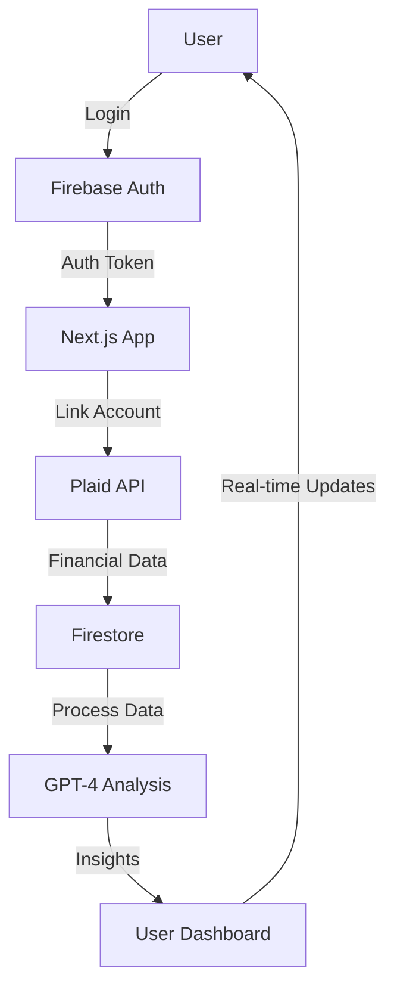

# FinSight AI Dashboard - Technical Design Document

## Project Overview

FinSight AI Dashboard is a comprehensive financial management platform that leverages artificial intelligence to provide personalized financial insights. The application aggregates financial data from multiple sources and uses GPT-4 to deliver actionable recommendations.

### Target Users
- Busy professionals seeking financial clarity
- Individuals with multiple financial accounts
- Users interested in AI-powered financial insights
- Freemium model users with varying feature access levels

### Core Functionality
- Multi-account financial data aggregation
- AI-powered financial insights and recommendations
- Real-time budget tracking and analysis
- Investment portfolio optimization
- Cash flow analysis and forecasting
- Risk assessment and alerts
- Personalized financial goal tracking

## Architecture

### Tech Stack
- **Frontend**: Next.js 14 with App Router
- **Language**: TypeScript
- **Styling**: Tailwind CSS
- **Authentication**: Firebase Auth
- **Database**: Firebase Firestore
- **Financial Data**: Plaid API
- **AI Integration**: OpenAI GPT-4
- **Deployment**: Vercel
- **State Management**: Zustand
- **Monitoring**: Sentry, Firebase Performance
- **Logging**: Winston + Firestore

### Data Flow



1. User authentication via Firebase Auth
2. Financial data aggregation through Plaid API
3. Data processing and storage in Firestore
4. GPT-4 analysis and insight generation
5. Real-time updates to user dashboard
6. Secure data transmission using HTTPS

### Component Boundaries
- **Authentication Layer**: Firebase Auth integration
- **Data Layer**: Plaid API integration and Firestore operations
- **AI Layer**: OpenAI GPT-4 integration
- **UI Layer**: Next.js components and pages
- **State Management**: Zustand store + React Context

### State Management Strategy
- **Zustand Store**:
  - Global app state
  - User preferences
  - Financial data cache
  - Authentication state
- **React Context**:
  - Theme preferences
  - Feature flags
  - Localization
- **Local State**:
  - Form inputs
  - UI toggles
  - Component-specific data

## Security Considerations

### API Security
- Firebase Security Rules for Firestore
- CORS configuration for API routes
- Rate limiting on all endpoints
- Input validation using Zod
- JWT token validation
- API key rotation policy

### Data Protection
- End-to-end encryption for sensitive data
- Secure storage of API keys
- Regular security audits
- GDPR compliance measures
- Data retention policies

## Monitoring & Logging

### Error Tracking
- Sentry for frontend error tracking
- Firebase Crashlytics for mobile
- Custom error boundaries
- Error reporting to admin dashboard

### Performance Monitoring
- Firebase Performance Monitoring
- Vercel Analytics
- Custom performance metrics
- Real User Monitoring (RUM)

### Logging Strategy
- Winston for structured logging
- Firestore for audit logs
- Log levels (error, warn, info, debug)
- Log rotation and retention

## Folder Structure & Conventions

```
finsight-ai/
├── app/                    # Next.js app router pages
│   ├── api/               # API routes
│   ├── (auth)/           # Authentication routes
│   └── dashboard/        # Dashboard routes
├── components/            # Reusable React components
│   ├── ui/              # Basic UI components
│   ├── features/        # Feature-specific components
│   └── layouts/         # Layout components
├── lib/                  # Utility functions and shared logic
│   ├── api/            # API client functions
│   ├── firebase/       # Firebase configuration
│   └── utils/          # Helper functions
├── store/               # Zustand store
│   ├── slices/         # Store slices
│   └── hooks/          # Store hooks
├── styles/              # Global styles and Tailwind config
├── public/              # Static assets
└── types/              # TypeScript type definitions
```

### Naming Conventions
- Components: PascalCase (e.g., `DashboardCard.tsx`)
- Utilities: camelCase (e.g., `formatCurrency.ts`)
- API Routes: kebab-case (e.g., `get-transactions.ts`)
- CSS Modules: `[name].module.css`

## Coding Standards

### TypeScript
- Strict mode enabled
- No `any` types without explicit justification
- Interface over type when possible
- Proper error handling with custom error types

### Tailwind CSS
- Use utility classes over custom CSS
- Follow mobile-first responsive design
- Maintain consistent spacing scale
- Use CSS variables for theming

### API Routes
- RESTful endpoint structure
- Proper error handling and status codes
- Rate limiting implementation
- Input validation using Zod

### Error Handling
- Global error boundary implementation
- Structured error responses
- Proper error logging
- User-friendly error messages

## Deployment

### Environments
- Development: `dev.finsight.ai`
- Staging: `staging.finsight.ai`
- Production: `finsight.ai`

### CI/CD
- GitHub Actions for automated testing
- Vercel for continuous deployment
- Automated security scanning
- Performance monitoring

### Environment Variables
- Development: `.env.development`
- Staging: `.env.staging`
- Production: `.env.production`

## Future Roadmap

### Phase 1 (Q2 2024)
- Cryptocurrency wallet integration
- Advanced portfolio analytics
- Custom alert system

### Phase 2 (Q3 2024)
- Subscription billing system
- Mobile PWA support
- Enhanced AI insights

### Phase 3 (Q4 2024)
- Tax optimization features
- Financial goal tracking
- Social sharing capabilities

### Phase 4 (Q1 2025)
- AI-powered financial advisor
- Advanced reporting
- API access for enterprise clients 