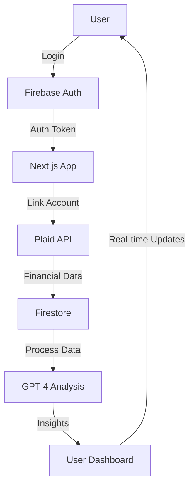

# FinSight AI Dashboard - Technical Design Document

## Project Overview

FinSight AI Dashboard is a comprehensive financial management platform that leverages artificial intelligence to provide personalized financial insights. The application aggregates financial data from multiple sources and uses GPT-4 to deliver actionable recommendations.

### Target Users

- Busy professionals seeking financial clarity
- Individuals with multiple financial accounts
- Users interested in AI-powered financial insights
- Freemium model users with varying feature access levels

### Core Functionality

- Multi-account financial data aggregation
- AI-powered financial insights and recommendations
- Real-time budget tracking and analysis
- Investment portfolio optimization
- Cash flow analysis and forecasting
- Risk assessment and alerts
- Personalized financial goal tracking

## Architecture

### Tech Stack

- **Frontend**: Next.js 14.1.0 with App Router
- **Language**: TypeScript 5.3.3
- **Styling**: Tailwind CSS 3.4.1
- **Authentication**: Firebase Auth 10.8.0
- **Database**: Firebase Firestore 10.8.0
- **Financial Data**: Plaid API v2020-09-14
- **AI Integration**: OpenAI GPT-4 API
- **Deployment**: Vercel
- **State Management**: Zustand 4.5.0
- **Monitoring**: Sentry 7.101.1, Firebase Performance
- **Logging**: Winston 3.11.0 + Firestore
- **Testing**: Jest 29.7.0, React Testing Library 14.2.1, Cypress 13.6.4

### Data Flow



### Database Schema

```typescript
// User Collection
interface User {
  id: string;
  email: string;
  displayName: string;
  createdAt: Timestamp;
  lastLogin: Timestamp;
  preferences: UserPreferences;
  subscription: Subscription;
}

// Financial Accounts Collection
interface FinancialAccount {
  id: string;
  userId: string;
  plaidItemId: string;
  institutionName: string;
  accountType: string;
  balance: number;
  lastSync: Timestamp;
  status: 'active' | 'error' | 'pending';
}

// Transactions Collection
interface Transaction {
  id: string;
  userId: string;
  accountId: string;
  amount: number;
  date: Timestamp;
  category: string;
  description: string;
  type: 'income' | 'expense';
  metadata: Record<string, any>;
}

// AI Insights Collection
interface AIInsight {
  id: string;
  userId: string;
  type: 'budget' | 'investment' | 'savings' | 'risk';
  content: string;
  createdAt: Timestamp;
  priority: 'high' | 'medium' | 'low';
  status: 'new' | 'read' | 'archived';
}
```

### API Specifications

#### Authentication Endpoints

```typescript
POST / api / auth / login;
POST / api / auth / register;
POST / api / auth / logout;
GET / api / auth / session;
```

#### Financial Data Endpoints

```typescript
POST / api / plaid / link - token;
POST / api / plaid / exchange - token;
GET / api / accounts;
GET / api / transactions;
GET / api / balance;
```

#### AI Insights Endpoints

```typescript
POST /api/insights/generate
GET /api/insights
PUT /api/insights/:id
```

### Security Protocols

#### Authentication

- JWT-based authentication
- Refresh token rotation
- Session management
- Rate limiting per user/IP

#### Data Protection

- End-to-end encryption for sensitive data
- API key rotation every 90 days
- Regular security audits
- GDPR compliance measures
- Data retention policies

#### API Security

- CORS configuration
- Rate limiting
- Input validation using Zod
- JWT token validation
- API key rotation policy

### Performance Benchmarks

#### Frontend Performance

- First Contentful Paint (FCP): < 1.5s
- Largest Contentful Paint (LCP): < 2.5s
- First Input Delay (FID): < 100ms
- Cumulative Layout Shift (CLS): < 0.1

#### API Performance

- Response Time: < 200ms
- Throughput: 1000 requests/second
- Error Rate: < 0.1%

#### Database Performance

- Read Latency: < 50ms
- Write Latency: < 100ms
- Query Performance: < 100ms

## Folder Structure & Conventions

```
finsight-ai-dashboard/
├── .cursor/              # Cursor configuration and rules (.mdc files)
├── .github/              # GitHub Actions workflows and issue templates
├── .husky/               # Husky Git hooks configuration
├── .vscode/              # VSCode editor settings and recommendations
├── app/                  # Next.js app directory (routes, pages, API handlers)
│   ├── (auth)/           # Authentication-related routes (e.g., login, register, password-reset)
│   ├── api/              # API routes (server-side handlers, kebab-case filenames)
│   │   └── v1/             # Versioned API routes (example)
│   ├── dashboard/        # Dashboard-specific routes and pages
│   ├── layout.tsx        # Root application layout component
│   ├── globals.css       # Global styles (Tailwind @layer, base styles, typography)
│   └── not-found.tsx     # Custom 404 page
├── components/           # React components, organized by scope
│   ├── features/         # Components specific to a feature or domain (e.g., AccountSettings, BudgetChart)
│   ├── layouts/          # Page and section layout components (e.g., DashboardLayout, PageWrapper)
│   ├── plaid/            # Plaid integration specific components (e.g., PlaidLinkButton)
│   ├── providers/        # Global context providers (e.g., AuthProvider, ThemeProvider, QueryProvider)
│   └── ui/               # Basic, reusable UI elements (e.g., Button, Input, Card, Modal, Spinner)
├── docs/                 # Project documentation (API.md, ADRs, etc.)
├── lib/                  # Core logic, SDK initializations, configurations
│   ├── config.ts         # Application configuration, environment variable access and validation
│   ├── firebase/         # Firebase SDK initialization and core service wrappers (e.g., auth.ts, firestore.ts)
│   ├── plaid/            # Plaid client initialization and core functions
│   └── stripe/           # Stripe SDK initialization (if applicable for subscriptions)
├── public/               # Static assets (images, fonts, favicons, robots.txt, sitemap.xml)
├── services/             # Data fetching and business logic layer, interacting with APIs or lib/
│   ├── apiClient.ts      # Centralized API client (e.g., Axios or fetch wrapper)
│   ├── financeService.ts # Service for financial data operations
│   └── userService.ts    # Service for user-related operations
├── store/                # Zustand global state management
│   ├── hooks.ts          # Custom hooks for accessing store state and actions
│   ├── index.ts          # Root store setup and export
│   └── slices/           # Individual state slices (e.g., userSlice.ts, settingsSlice.ts)
├── styles/               # Additional global styles or Tailwind plugins/presets (if globals.css is insufficient)
├── tests/                # All test files
│   ├── __fixtures__/     # Mock data, stubs, and factories for tests
│   ├── __mocks__/        # Manual mocks for libraries (e.g., next/navigation)
│   ├── e2e/              # End-to-end tests (Cypress or Playwright)
│   ├── integration/      # Integration tests (React Testing Library with MSW)
│   └── unit/             # Unit tests (Jest/Vitest + React Testing Library)
├── types/                # TypeScript type definitions and interfaces
│   ├── api/              # Types for API request/response payloads
│   ├── db.ts             # Firestore collection/document types (matches schema)
│   ├── index.ts          # Barrel file for exporting common types
│   └── zod.ts            # Shared Zod schemas if not co-located with API routes
└── utils/                # Utility functions, pure and reusable
    ├── constants.ts      # Application-wide constants
    ├── dateUtils.ts      # Date and time manipulation functions
    ├── formatters.ts     # Text, number, currency formatting functions
    └── validators.ts     # Generic validation functions (not Zod schemas)

# Root directory files
.env.example          # Example environment variables
.env.local            # Local environment variables (GIT_IGNORED)
.eslintrc.json        # ESLint configuration
.gitignore            # Git ignore rules
.prettierrc.json      # Prettier configuration
next.config.mjs       # Next.js configuration
package.json          # Project dependencies and scripts
README.md             # Project overview and setup guide
project.md            # This technical design document
stylelint.config.js   # Stylelint configuration (for CSS/Tailwind conventions)
tsconfig.json         # TypeScript configuration
```

### Naming Conventions

- Components: PascalCase (e.g., `DashboardCard.tsx`)
- Utilities: camelCase (e.g., `formatCurrency.ts`)
- API Routes: kebab-case (e.g., `get-transactions.ts`)
- CSS Modules: `[name].module.css`

## Coding Standards

### TypeScript

- Strict mode enabled
- No `any` types without explicit justification
- Interface over type when possible
- Proper error handling with custom error types

### Tailwind CSS

- Use utility classes over custom CSS
- Follow mobile-first responsive design
- Maintain consistent spacing scale
- Use CSS variables for theming

### API Routes

- RESTful endpoint structure
- Proper error handling and status codes
- Rate limiting implementation
- Input validation using Zod

### Error Handling

- Global error boundary implementation
- Structured error responses
- Proper error logging
- User-friendly error messages

## Deployment

### Environments

- Development: `dev.finsight.ai`
- Staging: `staging.finsight.ai`
- Production: `finsight.ai`

### CI/CD

- GitHub Actions for automated testing
- Vercel for continuous deployment
- Automated security scanning
- Performance monitoring

### Environment Variables

- Development: `.env.development`
- Staging: `.env.staging`
- Production: `.env.production`

> For detailed development roadmap and future plans, please refer to [ROADMAP.md](ROADMAP.md).
