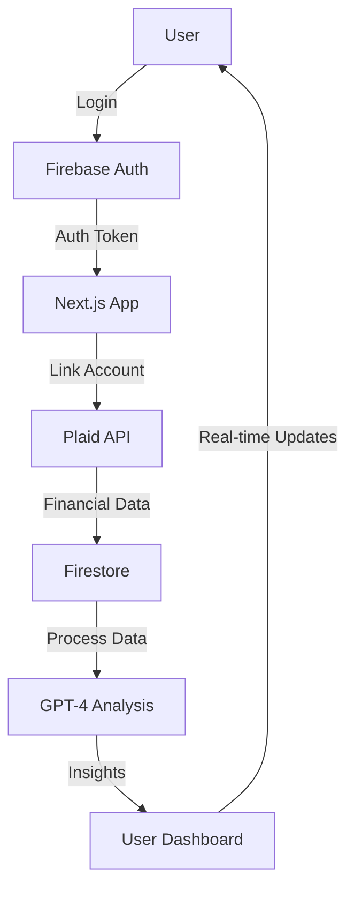

# FinSight AI Dashboard - Technical Design Document

## Project Overview

FinSight AI Dashboard is a comprehensive financial management platform that leverages artificial intelligence to provide personalized financial insights. The application aggregates financial data from multiple sources and uses GPT-4 to deliver actionable recommendations.

### Target Users

- Busy professionals seeking financial clarity
- Individuals with multiple financial accounts
- Users interested in AI-powered financial insights
- Freemium model users with varying feature access levels

### Core Functionality

- Multi-account financial data aggregation
- AI-powered financial insights and recommendations
- Real-time budget tracking and analysis
- Investment portfolio optimization
- Cash flow analysis and forecasting
- Risk assessment and alerts
- Personalized financial goal tracking

## Architecture

### Tech Stack

- **Frontend**: Next.js 14.1.0 with App Router
- **Language**: TypeScript 5.3.3
- **Styling**: Tailwind CSS 3.4.1
- **Authentication**: Firebase Auth 10.8.0
- **Database**: Firebase Firestore 10.8.0
- **Financial Data**: Plaid API v2020-09-14
- **AI Integration**: OpenAI GPT-4 API
- **Deployment**: Vercel
- **State Management**: Zustand 4.5.0
- **Monitoring**: Sentry 7.101.1, Firebase Performance
- **Logging**: Winston 3.11.0 + Firestore
- **Testing**: Jest 29.7.0, React Testing Library 14.2.1, Cypress 13.6.4

### Data Flow



### Database Schema

```typescript
// User Collection
interface User {
  id: string;
  email: string;
  displayName: string;
  createdAt: Timestamp;
  lastLogin: Timestamp;
  preferences: UserPreferences;
  subscription: Subscription;
}

// Financial Accounts Collection
interface FinancialAccount {
  id: string;
  userId: string;
  plaidItemId: string;
  institutionName: string;
  accountType: string;
  balance: number;
  lastSync: Timestamp;
  status: 'active' | 'error' | 'pending';
}

// Transactions Collection
interface Transaction {
  id: string;
  userId: string;
  accountId: string;
  amount: number;
  date: Timestamp;
  category: string;
  description: string;
  type: 'income' | 'expense';
  metadata: Record<string, any>;
}

// AI Insights Collection
interface AIInsight {
  id: string;
  userId: string;
  type: 'budget' | 'investment' | 'savings' | 'risk';
  content: string;
  createdAt: Timestamp;
  priority: 'high' | 'medium' | 'low';
  status: 'new' | 'read' | 'archived';
}
```

### API Specifications

#### Authentication Endpoints

```typescript
POST / api / auth / login;
POST / api / auth / register;
POST / api / auth / logout;
GET / api / auth / session;
```

#### Financial Data Endpoints

```typescript
POST / api / plaid / link - token;
POST / api / plaid / exchange - token;
GET / api / accounts;
GET / api / transactions;
GET / api / balance;
```

#### AI Insights Endpoints

```typescript
POST /api/insights/generate
GET /api/insights
PUT /api/insights/:id
```

### Security Protocols

#### Authentication

- JWT-based authentication
- Refresh token rotation
- Session management
- Rate limiting per user/IP

#### Data Protection

- End-to-end encryption for sensitive data
- API key rotation every 90 days
- Regular security audits
- GDPR compliance measures
- Data retention policies

#### API Security

- CORS configuration
- Rate limiting
- Input validation using Zod
- JWT token validation
- API key rotation policy

### Performance Benchmarks

#### Frontend Performance

- First Contentful Paint (FCP): < 1.5s
- Largest Contentful Paint (LCP): < 2.5s
- First Input Delay (FID): < 100ms
- Cumulative Layout Shift (CLS): < 0.1

#### API Performance

- Response Time: < 200ms
- Throughput: 1000 requests/second
- Error Rate: < 0.1%

#### Database Performance

- Read Latency: < 50ms
- Write Latency: < 100ms
- Query Performance: < 100ms

## Folder Structure & Conventions

```
finsight-ai-dashboard/
├── .cursor/              # Cursor configuration and rules (.mdc files)
├── .github/              # GitHub Actions workflows and issue templates
├── .husky/               # Husky Git hooks configuration
├── .vscode/              # VSCode editor settings and recommendations
├── app/                  # Next.js app directory (routes, pages, API handlers)
│   ├── (auth)/           # Authentication-related routes (e.g., login, register, password-reset)
│   ├── api/              # API routes (server-side handlers, kebab-case filenames)
│   │   └── v1/             # Versioned API routes (example)
│   ├── dashboard/        # Dashboard-specific routes and pages
│   ├── layout.tsx        # Root application layout component
│   ├── globals.css       # Global styles (Tailwind @layer, base styles, typography)
│   └── not-found.tsx     # Custom 404 page
├── components/           # React components, organized by scope
│   ├── features/         # Components specific to a feature or domain (e.g., AccountSettings, BudgetChart)
│   ├── layouts/          # Page and section layout components (e.g., DashboardLayout, PageWrapper)
│   ├── plaid/            # Plaid integration specific components (e.g., PlaidLinkButton)
│   ├── providers/        # Global context providers (e.g., AuthProvider, ThemeProvider, QueryProvider)
│   └── ui/               # Basic, reusable UI elements (e.g., Button, Input, Card, Modal, Spinner)
├── docs/                 # Project documentation (API.md, ADRs, etc.)
├── lib/                  # Core logic, SDK initializations, configurations
│   ├── config.ts         # Application configuration, environment variable access and validation
│   ├── firebase/         # Firebase SDK initialization and core service wrappers (e.g., auth.ts, firestore.ts)
│   ├── plaid/            # Plaid client initialization and core functions
│   └── stripe/           # Stripe SDK initialization (if applicable for subscriptions)
├── public/               # Static assets (images, fonts, favicons, robots.txt, sitemap.xml)
├── services/             # Data fetching and business logic layer, interacting with APIs or lib/
│   ├── apiClient.ts      # Centralized API client (e.g., Axios or fetch wrapper)
│   ├── financeService.ts # Service for financial data operations
│   └── userService.ts    # Service for user-related operations
├── store/                # Zustand global state management
│   ├── hooks.ts          # Custom hooks for accessing store state and actions
│   ├── index.ts          # Root store setup and export
│   └── slices/           # Individual state slices (e.g., userSlice.ts, settingsSlice.ts)
├── styles/               # Additional global styles or Tailwind plugins/presets (if globals.css is insufficient)
├── tests/                # All test files
│   ├── __fixtures__/     # Mock data, stubs, and factories for tests
│   ├── __mocks__/        # Manual mocks for libraries (e.g., next/navigation)
│   ├── e2e/              # End-to-end tests (Cypress or Playwright)
│   ├── integration/      # Integration tests (React Testing Library with MSW)
│   └── unit/             # Unit tests (Jest/Vitest + React Testing Library)
├── types/                # TypeScript type definitions and interfaces
│   ├── api/              # Types for API request/response payloads
│   ├── db.ts             # Firestore collection/document types (matches schema)
│   ├── index.ts          # Barrel file for exporting common types
│   └── zod.ts            # Shared Zod schemas if not co-located with API routes
└── utils/                # Utility functions, pure and reusable
    ├── constants.ts      # Application-wide constants
    ├── dateUtils.ts      # Date and time manipulation functions
    ├── formatters.ts     # Text, number, currency formatting functions
    └── validators.ts     # Generic validation functions (not Zod schemas)

# Root directory files
.env.example          # Example environment variables
.env.local            # Local environment variables (GIT_IGNORED)
.eslintrc.json        # ESLint configuration
.gitignore            # Git ignore rules
.prettierrc.json      # Prettier configuration
next.config.mjs       # Next.js configuration
package.json          # Project dependencies and scripts
README.md             # Project overview and setup guide
project.md            # This technical design document
stylelint.config.js   # Stylelint configuration (for CSS/Tailwind conventions)
tsconfig.json         # TypeScript configuration
```

### Naming Conventions

- Components: PascalCase (e.g., `DashboardCard.tsx`)
- Utilities: camelCase (e.g., `formatCurrency.ts`)
- API Routes: kebab-case (e.g., `get-transactions.ts`)
- CSS Modules: `[name].module.css`

## Coding Standards

### TypeScript

- Strict mode enabled
- No `any` types without explicit justification
- Interface over type when possible
- Proper error handling with custom error types

### Tailwind CSS

- Use utility classes over custom CSS
- Follow mobile-first responsive design
- Maintain consistent spacing scale
- Use CSS variables for theming

### API Routes

- RESTful endpoint structure
- Proper error handling and status codes
- Rate limiting implementation
- Input validation using Zod

### Error Handling

- Global error boundary implementation
- Structured error responses
- Proper error logging
- User-friendly error messages

## Deployment

### Environments

- Development: `dev.finsight.ai`
- Staging: `staging.finsight.ai`
- Production: `finsight.ai`

### CI/CD

- GitHub Actions for automated testing
- Vercel for continuous deployment
- Automated security scanning
- Performance monitoring

### Environment Variables

- Development: `.env.development`
- Staging: `.env.staging`
- Production: `.env.production`

## Environment Variables Documentation

### Required Environment Variables

#### Firebase Configuration

**Client SDK (Frontend)**
- `NEXT_PUBLIC_FIREBASE_API_KEY` - Firebase API key
- `NEXT_PUBLIC_FIREBASE_AUTH_DOMAIN` - Firebase auth domain (*.firebaseapp.com)
- `NEXT_PUBLIC_FIREBASE_PROJECT_ID` - Firebase project ID
- `NEXT_PUBLIC_FIREBASE_STORAGE_BUCKET` - Firebase storage bucket (*.appspot.com)
- `NEXT_PUBLIC_FIREBASE_MESSAGING_SENDER_ID` - Firebase messaging sender ID
- `NEXT_PUBLIC_FIREBASE_APP_ID` - Firebase app ID
- `NEXT_PUBLIC_FIREBASE_MEASUREMENT_ID` - Optional: Google Analytics measurement ID

**Admin SDK (Backend)**
- `FIREBASE_PROJECT_ID` - Firebase project ID
- `FIREBASE_CLIENT_EMAIL` - Service account email
- `FIREBASE_PRIVATE_KEY` - Service account private key (multi-line string)

#### Plaid Configuration

- `PLAID_CLIENT_ID` - Plaid client ID from dashboard
- `PLAID_SECRET` - Plaid secret key for chosen environment
- `PLAID_ENV` - Environment: "sandbox", "development", or "production"
- `PLAID_PRODUCTS` - Comma-separated list: transactions,auth,identity,balance,investments
- `PLAID_COUNTRY_CODES` - Comma-separated list: US,CA,GB,ES,FR,NL,IE
- `PLAID_REDIRECT_URI` - Optional: OAuth redirect URI
- `PLAID_WEBHOOK_URL` - Optional: Webhook endpoint URL

#### OpenAI Configuration

- `OPENAI_API_KEY` - OpenAI API key
- `OPENAI_TEMPERATURE` - Model temperature (e.g., "0.5")
- `OPENAI_MAX_TOKENS` - Max tokens per request (e.g., "2000")
- `OPENAI_MODEL` - Model name (e.g., "gpt-4-turbo")

#### Application Configuration

- `NEXT_PUBLIC_APP_URL` - Base URL for the application
- `NEXT_PUBLIC_API_URL` - API base URL (if different from app URL)

### Environment Setup

1. Copy `.env.example` to `.env.local`
2. Fill in all required values
3. Ensure `.env.local` is in `.gitignore`
4. Never commit environment files with actual values

## Detailed Directory Structure

```
src/
├── app/                    # Next.js App Router
│   ├── (auth)/            # Auth group route - login, signup, reset-password, verify-email
│   │   ├── login/         # Login page
│   │   ├── signup/        # Registration page
│   │   ├── reset-password/ # Password reset flow
│   │   └── verify-email/  # Email verification page
│   ├── api/               # API routes (kebab-case naming)
│   │   ├── accounts/      # Financial account endpoints
│   │   ├── auth/          # Authentication endpoints
│   │   ├── chat/          # AI chat endpoints
│   │   ├── insights/      # AI insights endpoints
│   │   ├── liquid-assets/ # Asset management endpoints
│   │   ├── manual-data/   # Manual data entry endpoints
│   │   ├── plaid/         # Plaid integration endpoints
│   │   │   ├── create-link-token/
│   │   │   ├── exchange-public-token/
│   │   │   ├── remove-item/
│   │   │   └── transactions/
│   │   └── transactions/  # Transaction endpoints
│   ├── accounts/          # Accounts management page
│   ├── chat/              # AI chat interface
│   ├── dashboard/         # Main dashboard
│   ├── help/              # Help documentation
│   ├── insights/          # Financial insights page
│   ├── manual-data/       # Manual data entry
│   ├── settings/          # User settings
│   ├── transactions/      # Transaction history
│   ├── globals.css        # Global styles
│   ├── layout.tsx         # Root layout
│   └── page.tsx           # Home page
├── components/
│   ├── auth/              # Authentication components
│   │   ├── AuthGuard.tsx  # Route protection
│   │   ├── LoginForm.tsx  # Login form
│   │   ├── SignupForm.tsx # Registration form
│   │   └── SocialAuth.tsx # Social login buttons
│   ├── common/            # Shared components
│   │   ├── ErrorBoundary.tsx
│   │   ├── ErrorMessage.tsx
│   │   ├── Footer.tsx
│   │   ├── Header.tsx
│   │   ├── LoadingSpinner.tsx
│   │   ├── Logo.tsx
│   │   └── Navigation.tsx
│   ├── dashboard/         # Dashboard-specific components
│   │   ├── AIInsights.tsx
│   │   ├── AssetsSection.tsx
│   │   ├── BudgetSection.tsx
│   │   ├── ChartsSection.tsx
│   │   ├── DashboardContent.tsx
│   │   ├── DebtPayoffTimeline.tsx
│   │   ├── FabModal.tsx
│   │   ├── FinancialHealthScore.tsx
│   │   ├── InvestmentPerformance.tsx
│   │   ├── LiabilitiesSection.tsx
│   │   ├── NetWorthDisplay.tsx
│   │   ├── OverviewCards.tsx
│   │   ├── RecentTransactions.tsx
│   │   └── UndoToast.tsx
│   ├── insights/          # Insights components
│   │   ├── InsightCard.tsx
│   │   ├── MetricDisplay.tsx
│   │   ├── PlaidDataWarning.tsx
│   │   └── SpendingByCategoryDisplay.tsx
│   ├── layout/            # Layout components
│   │   ├── ClientLayout.tsx
│   │   ├── ClientWrapper.tsx
│   │   └── MainLayout.tsx
│   ├── plaid/             # Plaid integration
│   │   └── PlaidLinkButton.tsx
│   ├── providers/         # Context providers
│   │   ├── SessionProvider.tsx
│   │   └── SWRProvider.tsx
│   ├── transactions/      # Transaction components
│   │   ├── CategoryBreakdown.tsx
│   │   ├── DateRangeSelector.tsx
│   │   └── TransactionsList.tsx
│   ├── ui/                # Base UI components
│   │   ├── Button.tsx
│   │   ├── Tabs.tsx
│   │   └── Tooltip.tsx
│   └── widgets/           # Reusable widgets
│       └── NetWorthWidget.tsx
├── hooks/                 # Custom React hooks
│   ├── use-dashboard-data.ts
│   ├── use-net-worth.ts
│   ├── use-transactions.ts
│   └── use-user.ts
├── lib/                   # Core library code
│   ├── auth.ts           # Authentication utilities
│   ├── config.ts         # Environment configuration
│   ├── finance.ts        # Financial calculations
│   ├── firebase-admin.ts # Firebase Admin SDK
│   ├── firebase.ts       # Firebase Client SDK
│   ├── logger.ts         # Winston logger setup
│   ├── openai.ts         # OpenAI client
│   └── plaid.ts          # Plaid client
├── middleware/            # Next.js middleware
│   ├── rate-limit.ts     # Rate limiting middleware
│   └── index.ts          # Main middleware
├── tests/                 # Test files
│   ├── api/              # API route tests
│   │   └── insights.test.ts
│   ├── components/       # Component tests
│   │   ├── InsightsPage.test.tsx
│   │   └── ui/
│   │       └── Tabs.test.tsx
│   └── openai/           # OpenAI integration tests
│       └── openai.test.ts
├── types/                 # TypeScript types
│   └── finance.ts        # Financial data types
└── utils/                 # Utility functions
    ├── category-color.ts # Category color mapping
    ├── chart-data.ts     # Chart data formatting
    ├── format-date.ts    # Date formatting
    ├── format.ts         # General formatting
    ├── get-css-var-color.ts # CSS variable utilities
    ├── tailwind.ts       # Tailwind utilities
    └── to-rgba.ts        # Color conversion
```

## Development Best Practices

### Code Organization

1. **Feature-based Structure**: Group related components, hooks, and utilities by feature
2. **Barrel Exports**: Use index.ts files for cleaner imports
3. **Separation of Concerns**: Keep business logic in services/lib, UI logic in components
4. **Type Safety**: Define all data structures with TypeScript interfaces

### API Development

1. **Input Validation**: All API routes must use Zod schemas
2. **Error Handling**: Return consistent error response format
3. **Authentication**: Verify JWT tokens on protected routes
4. **Rate Limiting**: Implement per-user and per-IP limits
5. **Logging**: Log all API requests and errors

### Component Development

1. **Composition**: Build complex components from simple ones
2. **Props Interface**: Always define TypeScript interfaces for props
3. **Error Boundaries**: Wrap feature components in error boundaries
4. **Loading States**: Handle loading, error, and empty states
5. **Accessibility**: Include ARIA labels and keyboard navigation

### State Management

1. **SWR for Server State**: Use SWR for data fetching and caching
2. **React Hooks for Local State**: useState, useReducer for component state
3. **Context for Global State**: Authentication, theme, user preferences
4. **Avoid Prop Drilling**: Use context or component composition

### Testing Strategy

1. **Unit Tests**: Test utilities, hooks, and pure functions
2. **Integration Tests**: Test API routes with mocked dependencies
3. **Component Tests**: Test user interactions and state changes
4. **E2E Tests**: Test critical user flows (login, transactions, etc.)
5. **Coverage Target**: Maintain >80% code coverage

## Troubleshooting Guide

### Common Development Issues

#### Build Errors

**Module not found**
```bash
# Clear Next.js cache
rm -rf .next
npm install
npm run build
```

**TypeScript errors**
```bash
# Check for type errors
npm run type-check
# Generate missing types
npm run generate-types
```

#### Runtime Errors

**Firebase Auth Errors**
- Verify Firebase configuration in `.env.local`
- Check domain is added to Firebase Auth settings
- Ensure service account has proper permissions

**Plaid Connection Issues**
- Verify Plaid environment matches credentials
- Check if products are enabled in Plaid dashboard
- Ensure redirect URI is registered (for OAuth)

**OpenAI Rate Limits**
- Implement exponential backoff
- Cache AI responses when appropriate
- Monitor usage in OpenAI dashboard

#### Database Issues

**Firestore Permission Denied**
- Check security rules in Firebase console
- Verify user authentication state
- Ensure indexes are created for complex queries

**Data Sync Issues**
- Check Plaid webhook configuration
- Verify background jobs are running
- Monitor Firestore usage limits

### Performance Optimization

1. **Code Splitting**: Use dynamic imports for large components
2. **Image Optimization**: Use Next.js Image component
3. **Bundle Analysis**: Run `npm run analyze` to check bundle size
4. **Caching Strategy**: Implement proper cache headers
5. **Database Queries**: Use composite indexes for complex queries

### Security Checklist

1. **Authentication**: Verify JWT on every protected route
2. **Authorization**: Check user permissions for data access
3. **Input Validation**: Sanitize all user inputs
4. **SQL Injection**: Use parameterized queries (N/A for Firestore)
5. **XSS Prevention**: Sanitize rendered content
6. **CSRF Protection**: Use Next.js built-in CSRF protection
7. **Rate Limiting**: Implement on all public endpoints
8. **Secrets Management**: Never commit secrets, use env vars

## Monitoring and Logging

### Application Monitoring

- **Performance**: Vercel Analytics for web vitals
- **Errors**: Sentry for error tracking
- **Uptime**: Vercel monitoring
- **API Metrics**: Custom logging with Winston

### Log Levels

```typescript
logger.error('Critical error', { error, userId, context });
logger.warn('Warning condition', { warning, metadata });
logger.info('Information', { action, userId });
logger.debug('Debug information', { data });
```

### Metrics to Track

1. **User Metrics**: Signups, logins, active users
2. **Financial Metrics**: Accounts linked, transactions synced
3. **AI Usage**: Insights generated, tokens used
4. **Performance**: API response times, database query times
5. **Errors**: Error rates by endpoint, error types

> For detailed development roadmap and future plans, please refer to [ROADMAP.md](ROADMAP.md).
